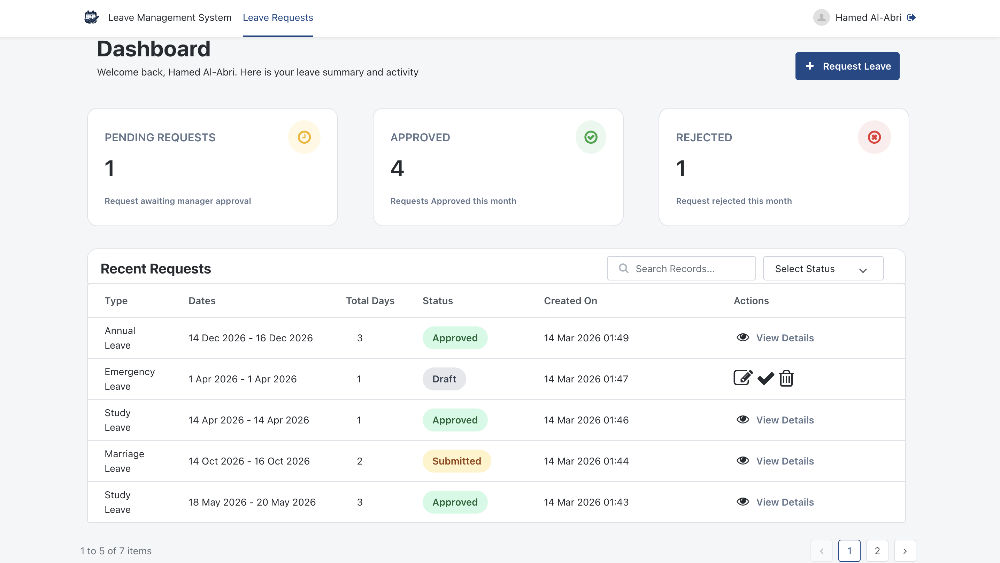
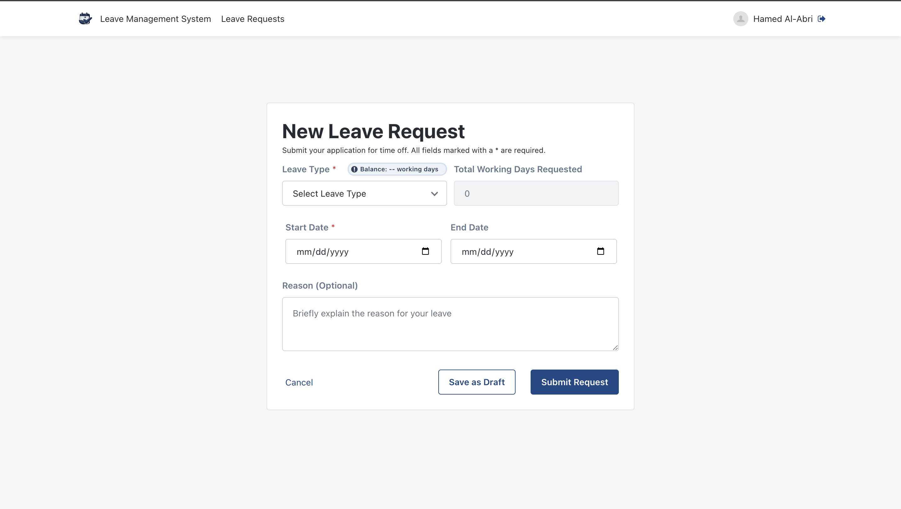
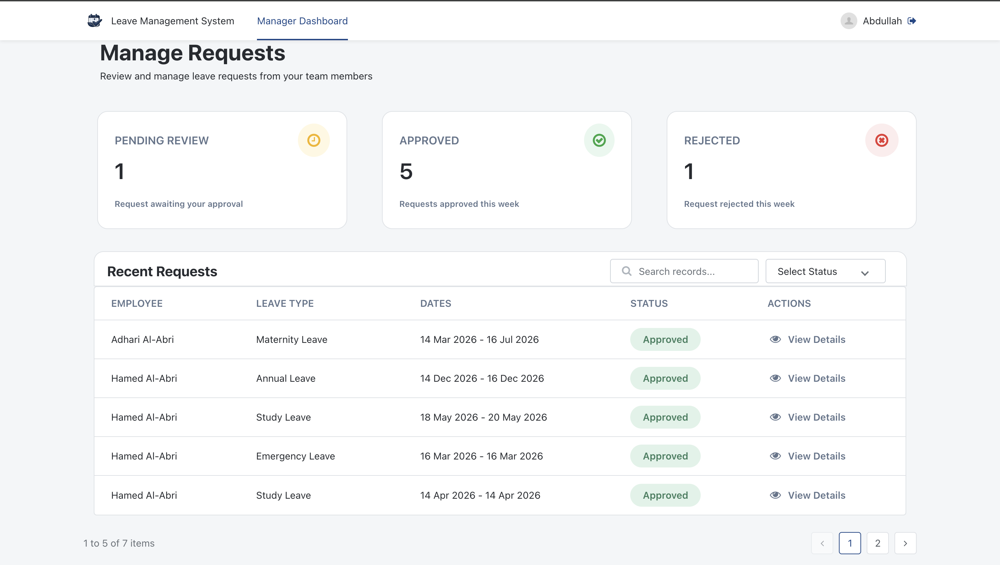
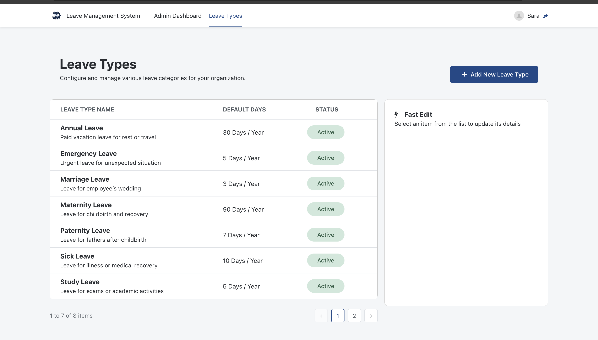
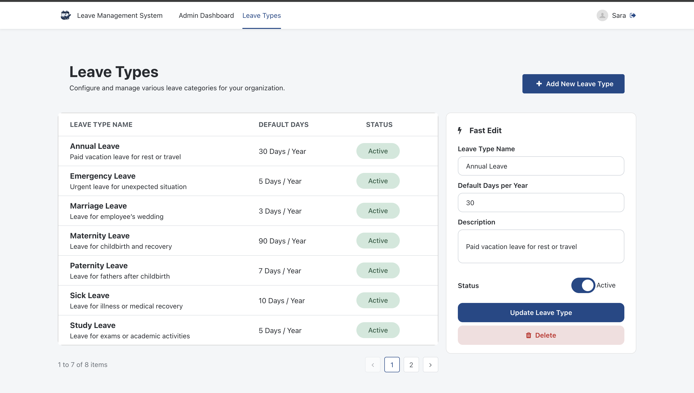
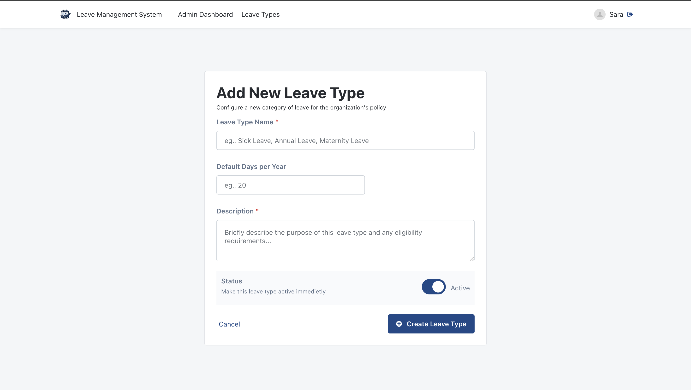
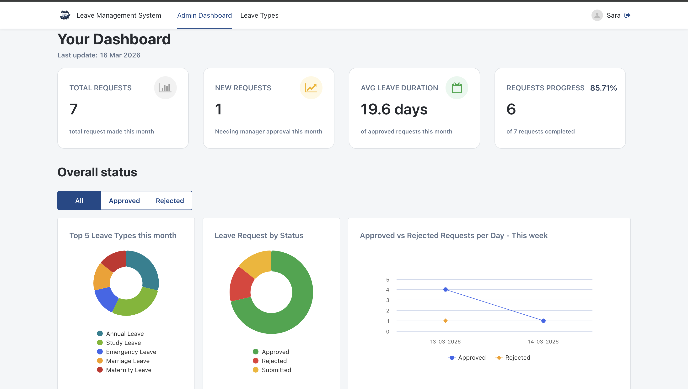
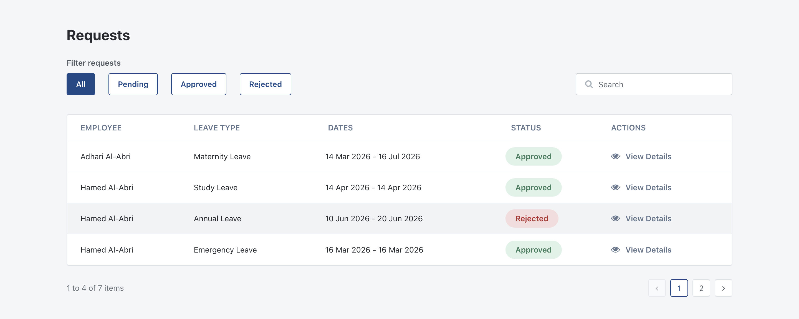

# Rihal CodeStacker OutSystems challenge 2026

# Leave Management System (OutSystems)

A **Leave Management System** built using **OutSystems** that allows employees to request leave and enables managers and administrators to efficiently review, approve, and manage leave requests.

The system automates leave tracking, reduces manual paperwork, and provides real-time visibility of employee leave balances.

---

## Project Overview

This project was developed as part of the **Rihal OutSystems Challenge 2026**.

The system provides a centralized platform where:

- Employees can submit and track leave requests
- Managers can approve or reject requests
- Administrators can manage leave types, monitor requests and view dashboards

The application improves efficiency by automating leave calculations, validation rules, and approval workflows.

---

## Live Demo

**Application URL**

https://personal-vakhoryl.outsystemscloud.com/LeaveManagementSystem/Login

### Demo Credentials

| Role | Username | Password | Description |
|-----|-----|-----|-----|
| Admin | Admin | Admin123 | Manage leave types and monitor all requests |
| Manager | Manager | Manager123 | Approve or reject employee requests |
| Employee | Employee | Employee12345678 | Create and manage leave requests |
| Employee | Employee2 | Employee2123 | Create and manage leave requests |

---

# System Objectives

- Automate employee leave requests  
- Provide real-time leave balance tracking  
- Simplify approval workflows  
- Reduce administrative workload  

---

# Features

## Employee Features

Employees can create, manage, and track their leave requests.

### Capabilities

- Submit or save leave requests as **draft**
- Edit or delete requests while in **draft status**
- View request history and track request status
- Dashboard displaying:
  - Pending requests
  - Approved requests this month
  - Rejected requests this month
- Search and filter requests by **leave type**, **status** or **leave name**

---

## Leave Request Form Features

The request form includes several automated calculations and validations:

### Balance Calculation

- Balance is calculated based on the **selected leave type**
- If the leave type has not been used before:
Balance = Default Days
- If the leave type has been used before:
Balance = Default Days − Approved Leave Days

---

### Automatic Working Day Calculation

The system automatically calculates the number of working days between the **start date and end date**, excluding weekends:

- Friday
- Saturday

---

### Validation Rules

The system enforces several validations:

- Users cannot submit a request if their **leave balance is 0**
- Total working days cannot exceed the available balance
- Start date must be **before end date**
- Start date **cannot be before today**
- Minimum leave duration = **1 working day**

Additionally:

- When the start date is selected, the end date automatically defaults to the same date.
- Leave type dropdown only displays **active leave types**.

---

# Manager Features

Managers can review and manage employee leave requests.

### Manager Dashboard

The dashboard provides an overview of:

- Pending approval requests
- Approved requests this week
- Rejected requests this week

Managers can:

- Approve or decline requests instantly
- View request details before deciding
- Search requests
- Filter requests by status

---

# Admin Features

Admins manage the leave system configuration and monitor overall activity.

---

## Leave Type Management

  
  

Admins can:

- Create new leave types
- Edit leave types
- Activate or deactivate leave types
- Delete leave types

### Soft Delete

Leave types are deleted using **soft delete** to ensure that historical leave request records remain intact.

Each leave type includes:

- Leave type name
- Default days per year
- Description
- Status (Active / Inactive)

Inactive leave types are hidden from the **leave request dropdown** in the leave request form.

---

# Admin Dashboard

The admin dashboard provides system-wide insights.

### Overview Metrics

- Total requests made this month
- Requests requiring manager approval
- Average leave duration
- Request completion progress

---

### Data Visualisation

Charts display:

- **Top 5 leave types requested this month**
- **Leave request distribution by status this month**
- **Approved vs rejected requests per day during the current week**

---

### Request Monitoring

Admins can:

- View all employee leave requests
- Search for specific requests
- Filter requests by status
- View detailed request information

---

# Challenges and Solutions

## Challenge 1: Dynamic Leave Balance Calculation

Ensuring that the system correctly calculates remaining leave balances when employees already have approved leave.

### Solution

A **client-side action** retrieves:

- Default leave days
- Total approved leave days

The system dynamically updates the leave balance whenever a leave type is selected.

---

## Challenge 2: Handling Null Values

When an employee selected a leave type that had not been used before, the system returned **null values**, leading to incorrect calculations.

### Solution

A validation condition checks if the approved leave days value is **null**.  
If no records exist, the system automatically replaces it with **0** and the balance will equal the default days for that particular leave type.

---

## Challenge 3: Maintaining Historical Data for Inactive Leave Types

Some leave requests were created using leave types that were later marked as inactive in the system. Normally, inactive leave types are hidden from selection lists to prevent users from choosing them for new requests. However, this created an issue when editing existing requests.

When a user opened an older leave request in the edit screen, the original leave type could not be displayed because it was inactive and therefore excluded from the available options.

### Solution

Inactive leave types are hidden from new selections but are still retrieved and displayed for existing requests to maintain **historical accuracy and data integrity**.

---

# Future Improvements

Possible future improvements include:

- Email notifications for request updates
- Multi-level approval workflows
- Department-based manager approvals
- Carry-forward leave balances for unused leave days

---

# Author

**Adhari Al-Abri**

Rihal OutSystems Challenge 2026

Email: adharialabri.68@gmail.com

